build-lists: true

## Cure What Ails You
### With This
# [fit] Rx
*an intro to the reactive extensions*

---

# Matt Soucoup
<br>
* Code Mill Technologies
* Xamarin MVP
* *_Blog:_* **codemilltech.com**
* *_Email:_* **msoucoup@codemilltech.com**
* *_Twitter:_* **@codemillmatt**
* https://github.com/codemillmatt/Rx-Cure

^ Talk a bit about how I got into Rx: *Develop Xamarin apps and need to handle lots of user input as well as server communication and IOT communication and that happens async - needed a better way to be alerted and a better way to handle as to when those happened

---

## We live in a push based world

* Tweets
* Taps & Touches
* Async I/O - DBs, REST services
* Web Sockets
* Device Services - GPS, BLE, etc

---

# [fit] We need a solid way to handle
# [fit] an async push based world!

---

# How about ... events?

---
# How about ... events?
### They have issues...

---

# How about ... events?
### They have issues...

* Difficult to implement / understand
* Stateful code
* Not async
* Memory leaks

^ There are many different ways to implement events - anonymous inline delegates. invoke a method, etc.
Because of this - the event can be difficult to follow by a new person looking at the code
When a decision within the event needs to be made - have stateful code
Events can lead to memory leaks. Need to add an event handler to an event to do something.
If we don't unsubscribe or release that event handler it's possible that whatever is throwing the event
Will get stuck in memory

---

# How about ... events?
### They have issues...


```csharp
var wedgesOfCheeseAte = 0;

eatCheese.Click += async(s, e) => {      
  if (wedgesOfCheeseAte < 3) {
    await devourDeliciousCheese();

    wedgesOfCheeseAte += 1;
  }

  // Possible memory leak!
}
```

---

# Isn't this better?

```csharp

eatCheese
  .Take(3)
  .Subscribe(async (_) => {
    await devourDeliciousCheese();
  });

```

---


# [fit] Rx Saves The Day!

---

# Agenda

* What is Reactive Programming & Rx
* Observables & Data Streams
* Thinking Reactive

^ Just an intro to Rx won't get in-depth, just show why it's cool
Examples will be .Net based

---

## What is Reactive Programming?
* Takes Observer Pattern - makes it better
* Push based
* Turns events into data streams
* A means to *react* to changes over time

---

## What are the Reactive Extensions?
> Rx creates a better event
-- Paul Betts

---

## What are the Reactive Extensions?

<br>
**A better question is...**

---

## What are the Reactive Extensions?
<br>
**A better question is...**
## What are events?
* A collection of *things* that happen over time
* A stream of data ...
    * Much like a list

---

## What are the Reactive Extensions?

* Provides a toolset to create event/data streams
  * May or may not end
  * Signal if they end
  * May or may not throw exception

---

## What are the Reactive Extensions?

* Provides a toolset to manipulate those streams

  * Transform (select)
  * Filter (where)
  * Aggregate (max, min, etc)
  * Combine (concat, zip)
  * Time-based (buffer, window)

^ Mention - what other thing do we know that can do this?
Transform things as a list?
Enumerables!

---

## Rx Turns
# [fit] Events
### into an
# [fit] Enumerable

---


---

## Some Benefits of Reactive Extensions?

Declaratively layout code

```csharp

eatCheese
  .Take(3)
  .Subscribe(async (_) => {
    await devourDeliciousCheese();
  });

```

---
## Some Benefits of Reactive Extensions?

Express intent without implementation details

```csharp

eatCheese
  .Take(3)
  .Subscribe(async (_) => {
    await devourDeliciousCheese();
  });

```

* Focus on business domain

---

## Some Benefits of Reactive Extensions?

Implementations for many languages
    * .Net
    * Java
    * Javascript
    * Python
    * Ruby
    * C++
    * Swift ...

^ Get to Declaratively layout code because we aren't focused on handling discrete events as they come in
Then lead into the next slide by saying ... how to we handle or model these Rx things around?

---

# [fit] Enter the Observable

---

# [fit] Enter the Observable
# [fit] ...but What Exactly Is It??

---

# An Observable Is A Stream of Data
* Async Cousin of Enumerable
* Instead of pulling data - push data
* Asynchronous, non-blocking
* Subscribe to perform some action
  * Similar to Enumerable.ForEach

---

# An Observable Does *Things* Through Time

1. Emit a value, and continue
2. Complete
3. Error

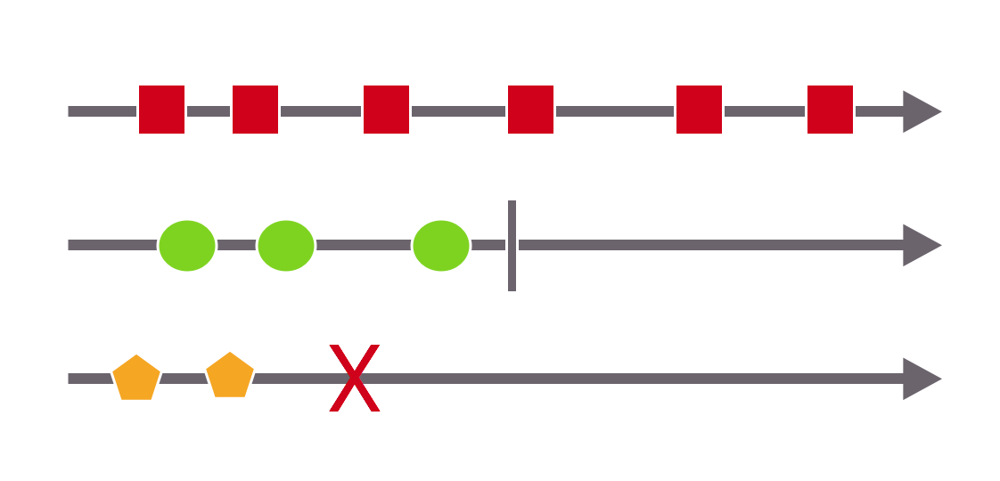

^ As each one comes up - talk about what it means in the diagram below
Mention how the stopping isn't bad - as in the previous example

---

## Anything Can Be An Observable
* Enumerable
* Tasks (async/callbacks)
* Events

---

## Observables Are Better Than Events
* Stream through time
* Notify when complete, exception
* LINQ manipulations!
* 1st class citizen
  * Chain operators
  * Pass as variables
* Subscribe to handle

---

# [fit] The Rx Mindset

---

## Rx vs Imperative

### The Imperative Way
* Listen for changes
* Implement details of handling
* Call a method
* Handle results immediately / inline
  * even with `async` and `await` or callbacks

^ Mention how we have to hope we got the state correct, etc.
Anything with timers makes the whole thing difficult
Look at an example of listening to keystrokes, ignoring duplicates, calling to web service

---

## Rx vs Imperative

### The Rx Way

* Define what will happen asynchronously
  * Observable
* Define any manipulations
  * Operators
* Subscribe to its results
  * Observer

---

# [fit] Demo Time!
<br>
## Keyup -> Search
    * Invoke dictionary lookup service
    * Query service every .5 sec max
    * Search box cannot be empty
    * Text changed since last query

---

## Rx vs Imperative
### The Imperative Way

```csharp
var keyStrokeTimer = new Timer (500);
var timeElapsedSinceChanged = true;

keyStrokeTimer.Start ();

keyStrokeTimer.Elapsed += (sender, e) => {
	timeElapsedSinceChanged = true;
};

var searchText = "";
searchField.EditingChanged += async (sender, e) => {
	keyStrokeTimer.Stop ();

	if (timeElapsedSinceChanged) {
		// Probably should do some locking
		timeElapsedSinceChanged = false;
		keyStrokeTimer.Stop ();

		if (!string.IsNullOrEmpty (searchField.Text)) {
			if (!searchText.Equals (searchField.Text)) {
				searchText = searchField.Text;

				var results = await SearchCheeses (searchText);

				foreach (var cheeseName in results) {
					Console.WriteLine (cheeseName);
				}
			}
		}
	}

	keyStrokeTimer.Start();
};
```

---
## Rx vs Imperative
### The Rx Way

```csharp
var editing = searchField.Events ().EditingChanged;

var searchSteam = editing
	.Select (_ => searchField.Text)
	.Where (t => !string.IsNullOrEmpty (t))
	.DistinctUntilChanged ()
	.Throttle (TimeSpan.FromSeconds (0.5))
	.SelectMany (t =>
		SearchCheeses (t));			                  

searchSteam.Subscribe (
	r =>
		r.ForEach(cheeseName =>
			Console.WriteLine($"Cheese name: {cheeseName}"))			
);
```

---

# Thinking In Rx
<br>
## Let go...
* Let go of imperative
* Let go of state
* Let go of pulling

---
# Thinking In Rx
<br>
## Instead
* Think of events through time
* Think in functional operators

^ One of the tools we have to do that are called marble diagrams

---

# Marble Diagrams
* Timeline of events
* Timeline of event operations

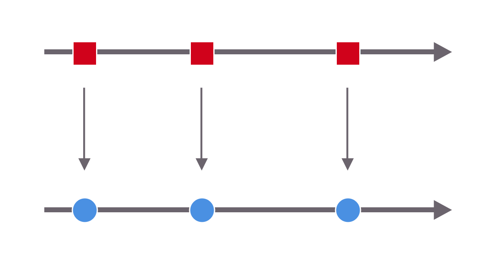

---

# Functional Operators

## Key to understanding Rx
* Transform (select)
* Filter (where)
* Aggregate (max, min, etc)
* Combine (merge, zip)
* Time-based (buffer, window)

---

# Operating on an Observable
* Operators take Observable
* Operators return Observable (sometimes)
* Chain 'em together!
* Operate in turn - one after the other

---

# Transform Diagram

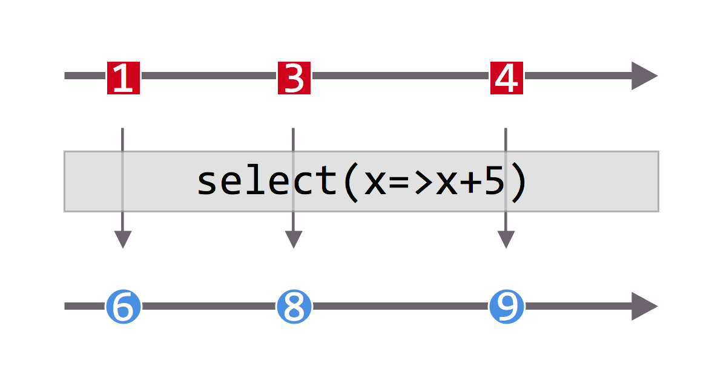

    * Transform an item by applying a function to it
    * aka: select, map, cast

---

# Filtering Diagram

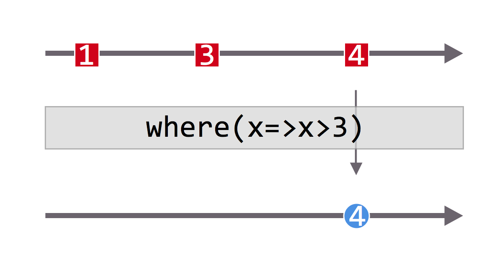

    * Filter the results based on a function
    * Only emit results that pass
    * aka: where, filter

---

# Filtering Diagram

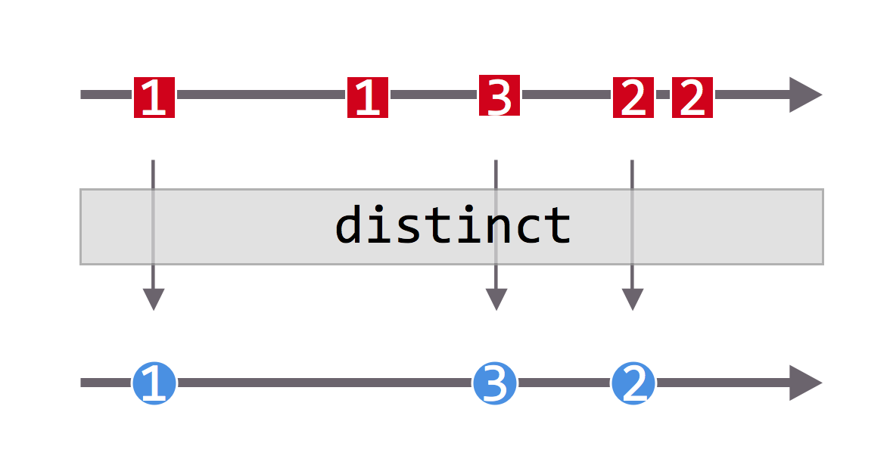

    * Distinct
    * Only emit items which have not been seen already

---

# Filtering Diagram

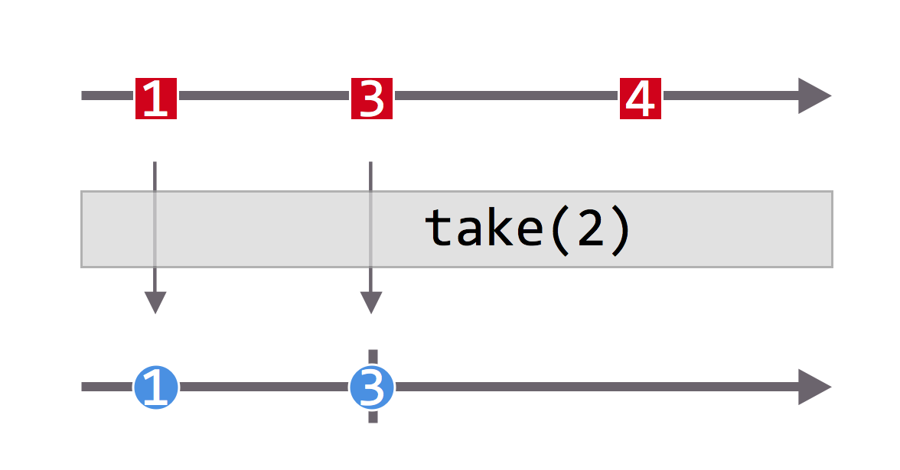

    * Take
    * Emit 'x' amount of items
    * Complete after 'x'

---

# [fit] Demo Time!
<br>
## Move Image Around Screen

---

# [fit] Demo Time!
<br>
## Move Image Around Screen
    * Make event args easier to deal with
    * Constrain image to left half of screen
    * Constrain image to top half of screen

---

# [fit] Demo Time!

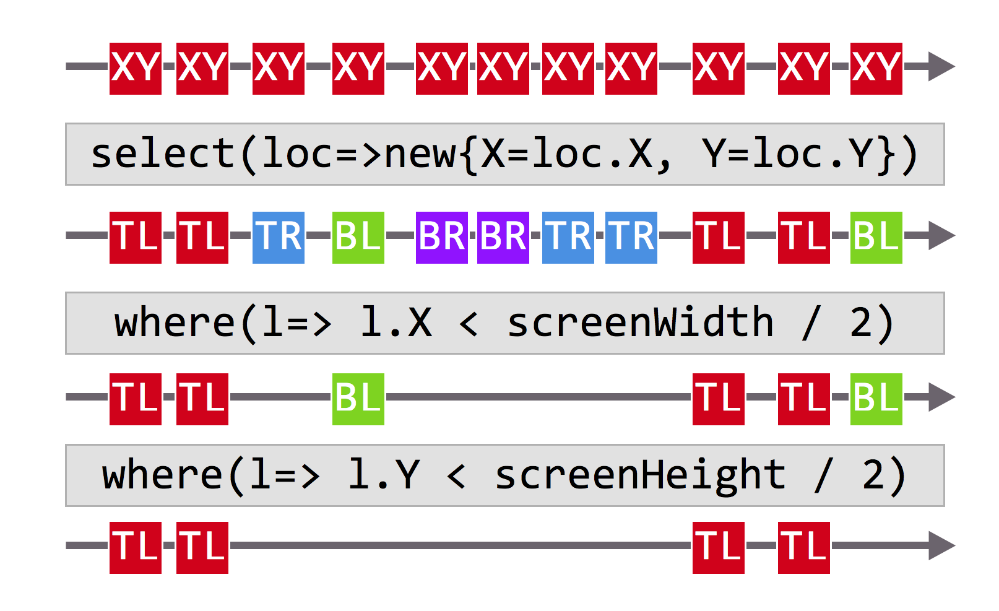

---

# [fit] Demo Time!
<br>
## Handle BLE advertisements

---

# [fit] Demo Time!
<br>
## Handle BLE advertisements
    * Many ads come in
    * Separate by device name
    * Only record distinct readings

---

# [fit] Demo Time!


---

# [fit] Demo Time!

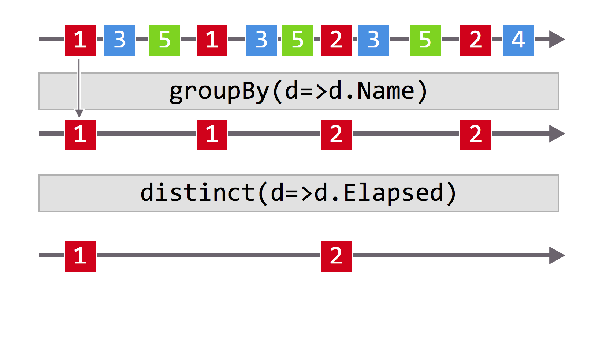

---

# Time Based Operators

* Events through time
* Operators to deal with those
  * Throttle
  * Window
  * Buffer
  * Delay
  * TimeInterval

---

# Time Based Diagram

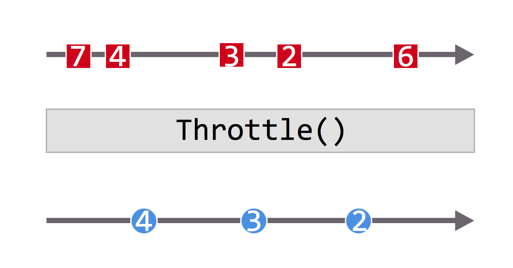

    * aka: throttle, debounce
    * Only emit an observable value if a specified amount of time has passed

---

# Time Based Diagram

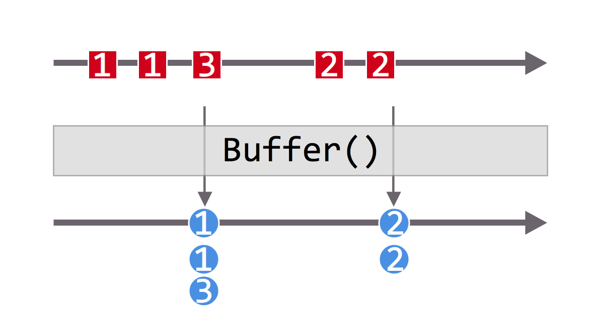

    * Emit a collection of items from an observable from a time span

---

# Time Based Diagram

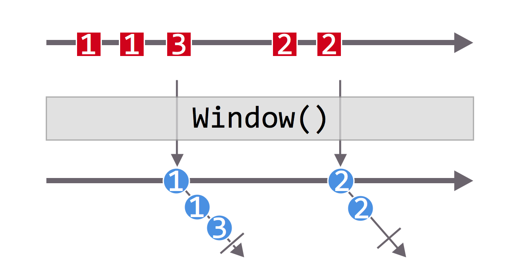

    * Emits observables instead of collections of items in a time span
    * Each observable "packet" is completed

---

# Time Based Diagram

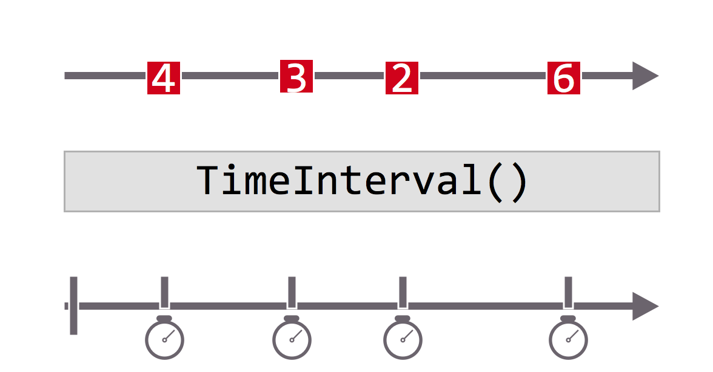

    * Outputs time since last observable emission

---

# When to use Rx
* Start with UI
* Events
* Network requests
* Async/Await - Callbacks
* Don't need to use all @ once!

---

# Summary
* Rx deals with async events
* Turns them into data streams
* Allows familiar manipulation of streams
* Anything Enumerable can do Observable can do!
* Think in Rx with marble diagrams

---

# More Info?

* https://github.com/codemillmatt/Rx-Cure
<br><br>
* http://reactivex.io/
* http://www.introtorx.com/

---

# Matt Soucoup

<br>
* Code Mill Technologies
* Xamarin MVP
* *_Blog:_* **codemilltech.com**
* *_Email:_* **msoucoup@codemilltech.com**
* *_Twitter:_* **@codemillmatt**
